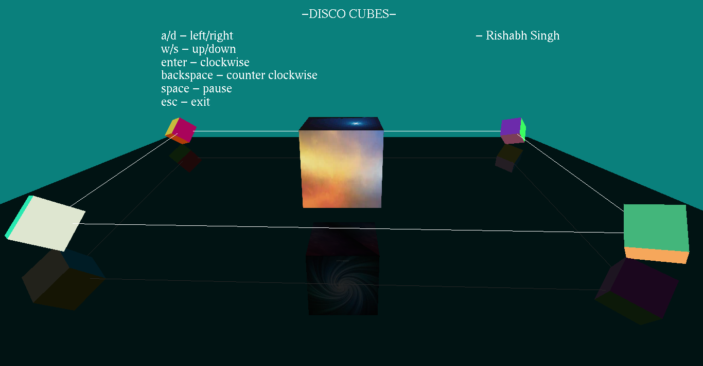
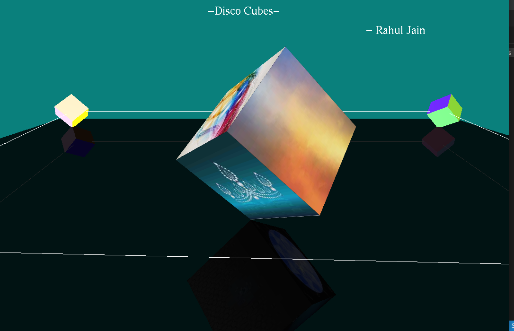

# Disco-Cubes

A Mini-Project on Computer Graphics using OpenGL.
The cubes randomly choose between images while the minicubes randomly generate colors.
All cubes are placed on on a reflective surface, Also showcases displaying Rasterised text.

## Screenshots

Landing Page

Zoomed In

## Usage

### Zoom

Zoom-Out
- z

Zoom-In
- x

### Move View

Left
- a

Right
- d

Up
- w

Down
- s

### Rotate Cube

Clockwise
- Enter key / Mouse Left Click

Anti-Clockwise
- Backspace key / Mouse Right Click

## Required libraries:

- SOIL (Simple OpenGL Image Loader)
- Gl/GLUT

### Installing Prerequisites (OpenGL in Linux)
#### On debian based systems
You can install the required dependencies using the following commands

    sudo apt-get update
    sudo apt-get install freeglut3
    sudo apt-get install freeglut3-dev
    sudo apt-get install libsoil-dev

## Compiling the File

> g++ main.cpp -o DiscoCubes -lglut -lGLU -lGL -lSOIL
> ./DiscoCubes

## References

 About Soil
>https://github.com/kbranigan/Simple-OpenGL-Image-Library

 About OpenGL 
>https://www.opengl.org

## Licence 

GNU General Public Licence 3.0
